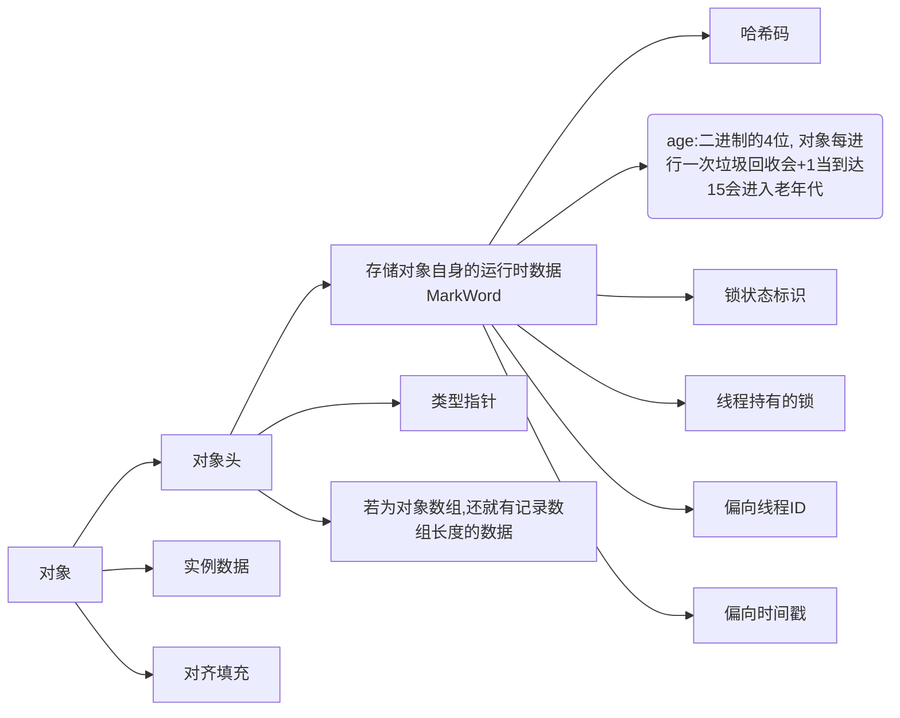
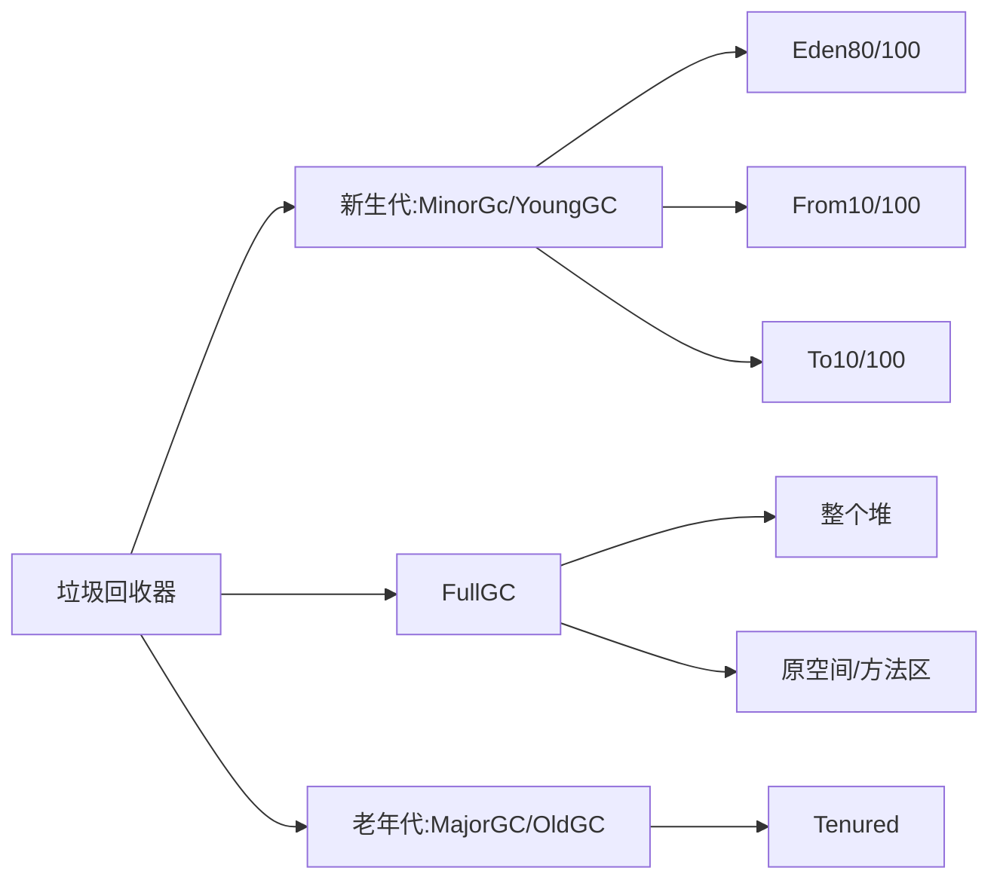

JVM

---- 

- 
- [JVM 对象引用](#JVM对象引用)
  - [类加载过程](##类加载过程) 
  - [java](#java)

#JVM对象引用
加载-->验证-->准备-->解析-->初始化

##类加载过程

##java
> javac 对 .java 编译为 .class  
> javap -c/-p 对 .class 反汇编  
>> 命令: java -cp ./sa-jdi.jar sun.jvm.hotspot.HSDB 
>>对运行内存进行分析  
> 
> [java虚拟机 JVM字节码用法](http://cloud.tencent.com/developer/article/1333540)

## JVM 内存模块:

 |垃圾回收 | 性能调优 | JVM自己优化反技术 |执行引擎 |监控工具|类文件结构 |类加载 -> 内存结构|
 | ---- |:---- | ---- | ---- | ---- | ---- | ---- |
 | JVM 内存区域||||||
 | java虚拟机 |class指令 |虚拟内存|
 |jvm运行时数据区|
 | 线程共享区 |线程私有区|
 |方法区 |运行时常量池 线程 1.虚拟机栈 2本地方法栈 3程序计数器| |||
 |堆|||||
 |直接内存 堆外内存|||||
 
## 虚拟机栈  

### 对象引用

>   存储当前线程运行java方法所需的 数据,指令,返回地址 StackOverflowError 栈异常  
>    大小限制 -Xss 默认1M  
>    栈溢出  
>    栈帧 
>     eg: (  
>            执行引擎的一个工作区  
>                JVM执行引擎 + 操作数栈 + 栈,堆  
>            eg: 操作系统  
>                CPU + 缓存 + 主内存  
>        )  
>        局部变量表(八大基础类型, 自定义对象引用),  
>        操作数栈,  
>        动态连接,  
>        完成出口 -> 返回地址  
>
>
> 程序计数器: 记录当前执行的地址偏移量 / 与操作系统上的程序计数器的一个映射  
> 本地方法栈: 虚拟机规范的.  

#### 常量池
- Class 常量池
- 运行时常量池
- 官网没有这个概念:字符串常量池

#### 判断对象的存活
- 引用计数算法 Class回收条件
- 可达性分析(根可达)
- finalize

#### 可达性分析
##### 根:
-  静态变量、线程栈变量、常量池、JNI（指针）
-  虚拟机栈（栈中的本地变量表）中的引用
-  方法区中类静态属性引用的对象
-  方法区中常量引用的对象
-  本地方法栈中JNI（即一般说的Native方法）引用的对象
-  JVM的内部引用Class引用（class对象异常对象NullPointException、OutofMemoryError，系统类加载器）
-  所有被同步锁（synchronized关键）持有的对象
-  JVM内部的JMXBean、JVMTI中注册的回调、本地代码缓存等
-  JVM实现中的“临时性”对象，跨代引用的对象

##### 注意Class回收条件
> 要回收class必须同时满足以下条件
1. 该类所有的都已经被回收也就是堆中不存在该类的任何实例
2. 加载该类的ClassLoader已经被回收
3. 该类对应的java.lang.Class对象没有在任何地方被引用，无法在任何通过反射访问该类的方法。
4. 参数控制 －Xnoclassgc

##### ~~Finalize 拯救对象~~
拯救: 不可达 到 可达
复写finalize对将要GC的数据分配上引用 
**注:** *只可调用一次,运行时有一定的延迟 可以用try{}finall{} 进行代替* 
#### 对象的引用
-  强引用 = Reference
-  软引用 SoftReference 做缓存 OOM 回收
-  弱引用 WealReference 做缓存 GC 回收
-  虚引用 PhantomReference

## 对象

*Mark Word* [^1]

## JVM中对象创建过程
> - 检查加载  
> - 分配内存 - TLAB  [^2]
>>  1. 划分内存方式
>>  2. 并发安全问题
> - 初始化
>> 1. 零值
> - 设置
>> 1. 对象头
> - 对象初始化
>> 1. 构造方法

## 堆

### 堆分成四部分  

> 如果Eden区满了则会对Eden区进行垃圾回收  
>> GC用 <复制回收算法>(根可达,强引用)  
>
> From区

> 新生代  MinorGC  
> 老年代  MajorGC  

|Eden|from|To|Tenured|
|----|----|----|----|
| | 当同时age为4的占50% 则把age为4的都入到  *Tenured* 区| |MajorGC|

### 对象的分配策略
|几乎所有的对象都在堆空间分配|虚拟机的优化技术|
|----|---|
|对象的分配原则 |                       逃逸分析(不会逃逸出方法) |
 |   |判断是否把对象分配到栈上|
|对象优化在Eden分配      |               本地线程分配缓冲|
|空间分配担保 [^3] ||
|大对象直接进入老年代||
|长期存活的对象 进入老年代||
|动态对象年龄判定||

----------------

# 分代回收机制及垃圾回收算法
## 垃圾回收基础

## 分代回收理论
1. 绝大部分对象都朝生夕死 -- 新生代
2. 熬过多次垃圾回收的对象就越难回收 -- 老年代

## 清除算法
>  1. 复制算法 -- 新生代
>  2. 标记清除算法 -- 老年代
>  3. 标记整理算法 -- 老年代
### 新生代 1/3
- 复制算法(Cpoying)
> 特点 :
>> 实现简单,运行高效  一次扫描一次复制
>> 没有内存碎片  
>> 空间利用率只有一半  
>> 
 - Enden 区的来源  
> Appel式回收算法  
>> Enden:From:To = 8:1:1  
>>
> 提高空间利用率和空间分配担保  

### 老年代 2/3
- 标记清除算法(通过根可达分析标记)

>　特点:
>> 位置不连续，产生碎片  
>> 效率略低  
>> 两遍扫描  
>> 空间利用率100%
>> 

- 标记整理算法

> 特点
>> 没有内存碎片  
>> 效率偏低  
>> 两遍扫描,指针需要调整
>>

##　JVM觉的垃圾回收器
> 单线程垃圾回收器  
> 多线程垃圾回收器　　
> 并发垃圾回收器

--- 
[^1]: 存储对象自身的运行时数据

[^2]: 划分内存的方式: 指针碰撞,空闲列表 解决并发安全: CAS加载失败重试,本地线程分配缓冲[TLAB]

[^3]: 如果老年代空间不足可能会尝试一次MajorGC/fullGC(全部:新生代,原空间/永久代,老年代)  
    悲观策略 -- MinorGC ---- MajorGC
